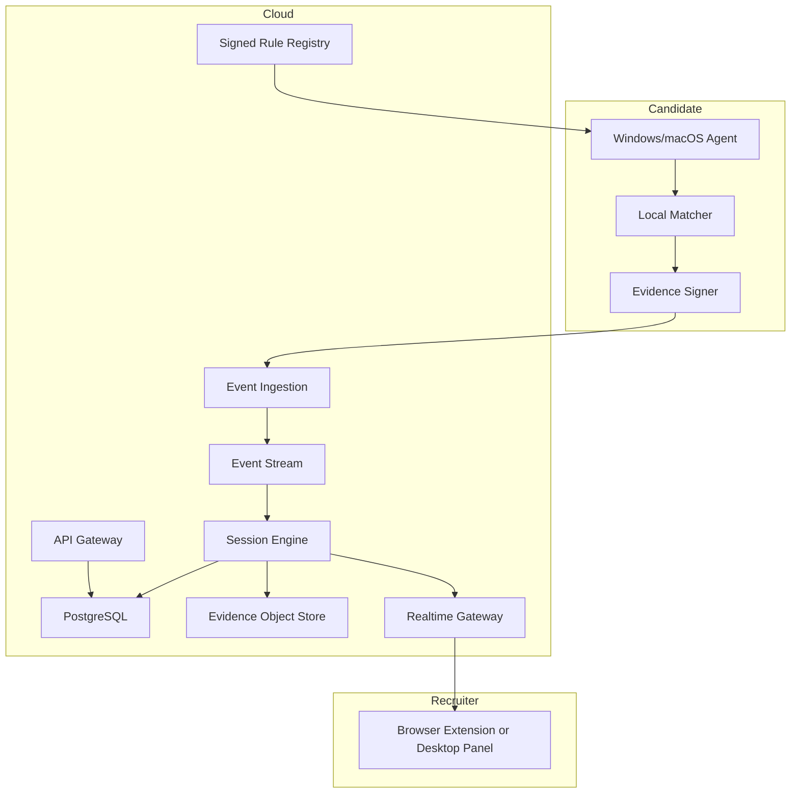
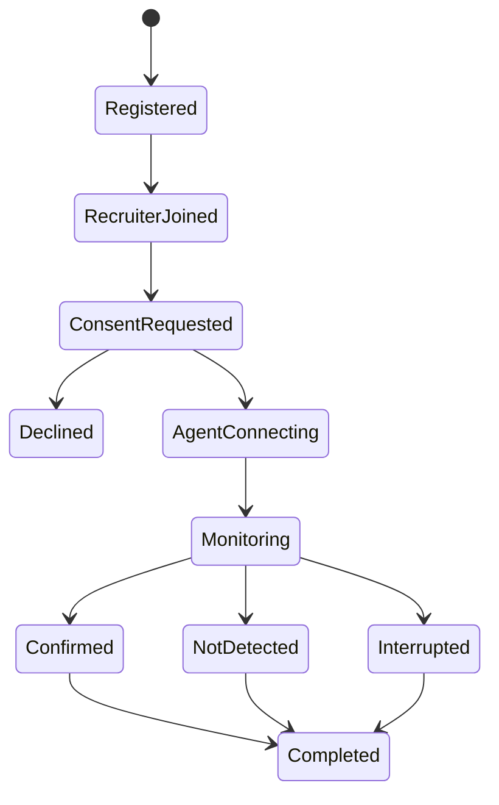

# Live Interview Cheating-Tool Detection Layer

## Codex-Ready System Design

**Status:** Planning specification  
**Target platforms:** Windows 11, macOS 13+  
**Meeting platforms:** Google Meet, Microsoft Teams, Zoom, Webex, and other web/native meeting tools  
**Scale target:** 100,000 concurrent protected interview sessions  
**Primary output:** `CONFIRMED` or `NOT_DETECTED`

---

## 1. Product Definition

The product is a protection layer around existing live meeting platforms. It does not replace Google Meet, Teams, Zoom, or Webex, and it does not conduct interviews.

The recruiter creates a meeting using their normal provider, registers the unchanged meeting URL, and sends that original URL to the candidate. After the candidate joins, the recruiter initiates a consented integrity check. A temporary Windows/macOS candidate agent detects supported AI cheating tools during the authorized monitoring window. A private recruiter panel displays live results.

### User-visible promise

> Keep using the same meeting link. At the beginning of the interview, initiate a consented integrity check and receive a private, real-time confirmation if a supported AI cheating tool is active.

### Binary result semantics

| Result | Exact meaning |
|---|---|
| `CONFIRMED` | A supported cheating tool's identity and active use were both proven using validated technical evidence during the monitoring window. |
| `NOT_DETECTED` | No supported cheating tool met the confirmation threshold during the monitoring window. |

`NOT_DETECTED` must never be represented as proof that no unknown tool, modified tool, or independent mobile device was used.

---

## 2. Non-Goals

The first product will not:

- Replace a meeting provider.
- Generate or change meeting URLs.
- Run an AI interviewer.
- Judge candidate knowledge or answer quality.
- Use eye movement, nervousness, accent, response quality, or facial expressions as cheating evidence.
- Classify arbitrary applications as cheating tools solely because they use audio, screen capture, Electron, or AI APIs.
- Confirm a mobile cheating tool running on an unrelated personal phone without direct device evidence.
- Monitor before explicit consent.
- Access personal files, messages, passwords, or unrelated browsing history.
- Automatically reject a candidate.

---

## 3. Critical Technical Constraint

A normal website, Google Meet participant, or recruiter-side extension cannot inspect applications running on the candidate's computer. Browsers and meeting providers intentionally do not expose remote process, window, audio-session, or package information.

Therefore, accurate desktop detection requires a candidate-side Windows/macOS integrity agent running after consent. The unchanged meeting URL can still be used; the protection is associated with the normalized meeting ID rather than implemented inside the URL.

For an independent mobile phone, neither the laptop agent nor an ordinary mobile webpage can inspect other mobile applications or browser tabs. Exact mobile tool identification requires managed-device capabilities, a device-management profile, or another directly installed monitoring component with OS-granted visibility. Secondary-camera observations can show phone use but cannot name the application and therefore do not affect the binary named-tool result.

---

## 4. Product Flow

### 4.1 Recruiter setup

1. Recruiter signs into the web application.
2. Recruiter clicks **Register Interview**.
3. Recruiter pastes the original Meet, Teams, Zoom, or Webex URL.
4. Backend normalizes the provider and meeting identifier.
5. Recruiter adds the candidate and scheduled time.
6. Recruiter sends the original meeting URL through their existing calendar/email flow.

Example:

```text
Original URL: https://meet.google.com/cve-bpgo-fgj
Normalized key: google_meet:cve-bpgo-fgj
```

### 4.2 Interview entry

1. Recruiter joins the normal meeting with the recruiter extension or desktop companion enabled.
2. Recruiter UI recognizes the normalized meeting key and opens the private protection panel.
3. Candidate joins using the unchanged meeting URL.
4. Recruiter panel shows `UNVERIFIED`.
5. Recruiter explains that the interview requires a brief integrity check.
6. Recruiter clicks **Start Integrity Check**.
7. The platform creates a one-time consent/activation URL and short code.
8. Recruiter sends the URL through meeting chat or displays a QR code.
9. Candidate reviews disclosure and explicitly consents.
10. Candidate launches the signed temporary integrity agent.
11. Agent binds to the meeting session using the one-time token.
12. Initial detection completes.
13. Recruiter sees `CONFIRMED` or `NOT_DETECTED`.

### 4.3 Continuous monitoring

1. Agent continues monitoring until the recruiter ends protection, the scheduled hard stop is reached, or the agent exits.
2. The local detection engine evaluates process/window/application changes.
3. Only signed detection evidence and health events are sent to the backend.
4. Recruiter receives live updates with a target latency below five seconds.
5. If the agent, permissions, or connection fail, the panel shows `MONITORING_INTERRUPTED`; it must not silently display `NOT_DETECTED`.

### 4.4 End of interview

1. Recruiter clicks **End Protection** or the session reaches its configured end condition.
2. Agent stops observing and deletes ephemeral session material.
3. Backend finalizes the evidence timeline.
4. Recruiter receives a post-session report.

---

## 5. High-Level Architecture



### Core architectural decision

Detection happens locally. The backend distributes signed rule bundles, receives signed evidence, maintains session state, and streams results. It does not continuously upload the candidate's raw screen, process list, or audio.

This provides:

- Lower detection latency.
- Better candidate privacy.
- Lower cloud bandwidth and compute cost.
- Operation during short network interruptions.
- Reduced exposure of sensitive device data.
- Easier scaling to 100,000 concurrent sessions.

---

## 6. Components

## 6.1 Recruiter web application

Responsibilities:

- Authentication and organization membership.
- Registering unchanged meeting URLs.
- Candidate/session management.
- Monitoring-policy configuration.
- Consent disclosure templates.
- Live session status.
- Evidence reports.
- Detection-rule coverage visibility.
- Billing and audit logs.

Suggested initial stack:

- Next.js/React/TypeScript.
- PostgreSQL.
- Redis for short-lived session presence.
- WebSocket or Server-Sent Events for live panel updates.

## 6.2 Recruiter meeting panel

### Browser providers

A browser extension supports:

- Google Meet.
- Teams Web.
- Zoom Web.
- Webex Web.

Provider adapters extract the normalized meeting identifier from the current page and inject a private side panel into the recruiter's page.

### Native providers

For Zoom Desktop and Teams Desktop, a recruiter desktop companion displays a private always-on-top panel positioned beside the meeting window.

The recruiter panel never performs candidate detection. It only displays backend session state and evidence.

## 6.3 Candidate integrity agent

The candidate agent contains:

1. **Session Controller**
   - Validates the one-time activation token.
   - Displays consent state.
   - Starts and stops all monitoring.
   - Enforces the authorized time window.

2. **Platform Sensor Layer**
   - Collects narrowly scoped process, application, signing, window, and active-use signals.
   - Has separate Windows and macOS implementations behind one normalized interface.

3. **Identity Extractor**
   - Produces normalized application identity observations.

4. **Local Rule Engine**
   - Evaluates signed tool fingerprints.
   - Does not depend on cloud AI for confirmation.

5. **Active-Use Verifier**
   - Confirms that the matched tool is actually running and in an assistance-related state.

6. **Evidence Builder**
   - Produces minimal evidence records.
   - Redacts unrelated process and path information.

7. **Evidence Signer**
   - Chains and signs events with the ephemeral session key.

8. **Health and Tamper Monitor**
   - Sends heartbeats.
   - Reports permission removal, shutdown, clock anomalies, and agent termination.

9. **Signed Rule Updater**
   - Downloads only verified rule bundles.
   - Supports rollback and version pinning.

10. **Secure Uninstaller/Exit**
    - Ends monitoring at session completion.
    - Removes ephemeral tokens and transient observations.

## 6.4 Detection rule registry

The registry stores versioned detection packs for each supported tool:

```text
detection-pack/
├── manifest
├── supported-platforms
├── supported-tool-versions
├── identity-rules
├── active-use-rules
├── exclusions
├── test-fixtures
├── validation-metrics
└── signature
```

Every pack includes:

- Tool name.
- Platforms.
- Tested versions.
- Exact and resilient identity fingerprints.
- Required active-use proof.
- Known legitimate conflicts.
- Minimum agent version.
- Expiration/revalidation date.
- Rule-author and reviewer identities.
- Cryptographic signature.

## 6.5 Session service

Responsibilities:

- Normalize and register meeting IDs.
- Mint one-time candidate activation tokens.
- Record consent version and timestamp.
- Manage session state transitions.
- Associate candidate evidence with the correct interview.
- Enforce tenant isolation and retention policy.

State machine:



`NOT_DETECTED` is valid only while monitoring is healthy. The final status must become `INTERRUPTED` if required monitoring visibility is lost for longer than the configured grace period.

## 6.6 Event ingestion and realtime delivery

Responsibilities:

- Authenticate agents.
- Validate event signatures, sequence numbers, timestamps, and replay protection.
- Append accepted events to a durable stream.
- Update materialized live-session state.
- Push status changes to recruiter panels.

Recommended logical infrastructure:

- Global/edge API gateway.
- Stateless ingestion service.
- Kafka-compatible event stream.
- Partitioning by `session_id`.
- Stream processor for session materialization.
- Redis for live presence and recent status.
- PostgreSQL for durable product/session data.
- Object storage for encrypted detailed evidence.
- WebSocket gateway for recruiter updates.

---

## 7. Detection Model

## 7.1 Two-gate confirmation

A supported tool is confirmed only when both gates pass:

```text
CONFIRMED =
    UNIQUE_TOOL_IDENTITY_CONFIRMED
    AND ACTIVE_DURING_AUTHORIZED_SESSION_CONFIRMED
    AND EVIDENCE_CHAIN_VALID
```

Everything else produces `NOT_DETECTED`, unless monitoring was unavailable, in which case the operational state is `MONITORING_INTERRUPTED`.

## 7.2 Gate A: unique tool identity

At least one authoritative identity family plus an independent corroborating signal is required.

### Authoritative identity families

- Exact executable hash for a validated release.
- Verified macOS signing Team ID plus bundle ID.
- Verified Windows Authenticode signer plus original file identity.
- Unique binary/resource signature validated against the clean corpus.
- Verified browser extension ID.
- Tool-specific package identity.

### Corroborating identity signals

- Fuzzy executable hash.
- Embedded resource hashes.
- Known installation layout.
- Tool-specific process tree.
- Native helper identity.
- Tool-specific window class/configuration.
- Known update service or protocol handler.

The following can never confirm identity alone:

- Process name.
- Electron runtime.
- AI-provider connection.
- Microphone access.
- Screen Recording permission.
- Hidden/always-on-top window.
- Candidate behaviour.

## 7.3 Gate B: active use

The confirmed identity must also be active during the authorized session.

Possible active-use evidence:

- Matching process running.
- Tool-specific live/listening mode active.
- Matching overlay created or updated.
- Tool-owned audio capture active.
- Tool-owned screen capture active.
- Verified browser assistant session active.
- Tool-specific runtime state transition observed.

An installed-but-closed application is not `CONFIRMED`.

## 7.4 Evidence independence

Rules must model evidence ancestry. Multiple fields derived from the same source must not be treated as independent.

Bad:

```text
Process name + product name + description
```

All may come from one metadata resource.

Good:

```text
Signing identity
+ unique resource signature
+ active tool-owned audio session
```

These come from separate evidence families.

## 7.5 Internal versus external states

Internal matcher states:

- `NO_MATCH`
- `CANDIDATE_MATCH`
- `IDENTITY_CONFIRMED`
- `ACTIVE_USE_CONFIRMED`
- `EVIDENCE_INVALID`
- `RULE_EXPIRED`

Recruiter tool result:

- `CONFIRMED`
- `NOT_DETECTED`

Operational integrity is displayed separately:

- `MONITORING_ACTIVE`
- `MONITORING_INTERRUPTED`
- `CONSENT_DECLINED`
- `UNVERIFIED`

---

## 8. Platform Sensors

## 8.1 macOS sensor plan

Initial supported data:

- Running application PID and executable URL.
- Bundle identifier and package metadata.
- Code-signing identity and Team ID.
- Executable/resource hashes.
- Parent-child process relationships where available.
- Application launch and termination events.
- Owned window metadata.
- Window level, bounds, visibility, and sharing state where available.
- Microphone and screen-recording authorization state.
- Relevant active audio/display-capture observations.
- Connected and virtual displays.

Likely APIs/frameworks to research and validate:

- `NSWorkspace`.
- Core Graphics window APIs.
- Security framework code-signing APIs.
- ScreenCaptureKit metadata.
- Core Audio APIs.
- Endpoint Security framework for a later production-hardening phase.

Important: Apple Endpoint Security capabilities require entitlements. The MVP must not assume approval. A formal entitlement request and fallback design are required.

## 8.2 Windows sensor plan

Initial supported data:

- Process start/stop events.
- Executable path and original filename.
- Authenticode signer and certificate thumbprint.
- Executable/resource hashes.
- Parent-child process relationships.
- Owned top-level/hidden windows.
- Extended window styles.
- Window capture-exclusion/display-affinity state.
- Relevant audio sessions.
- Display-capture indicators where observable.
- Connected and virtual displays.
- Remote Desktop/session state.

Likely APIs/frameworks to research and validate:

- ETW or WMI for process lifecycle.
- Win32 process and window APIs.
- `EnumWindows`.
- `GetWindowDisplayAffinity`.
- Windows trust/Authenticode APIs.
- Windows Core Audio session APIs.

The first release should remain user-mode. A kernel driver dramatically increases security, signing, operational, privacy, and support complexity and must not be included without a separate threat model.

## 8.3 Browser-based tools

Some cheating tools operate entirely in Chrome/Safari/Edge.

Desktop process inspection can identify the browser but not reliably attribute an active tab to a specific cheating product. Accurate browser-tool support requires a candidate-side browser extension with narrowly scoped permissions.

Supported evidence may include:

- Verified cheating-tool extension ID.
- Active tab origin for supported tool domains.
- Tool-specific service worker/extension state where browser APIs expose it.
- Active audio-capture tab associated with a confirmed tool origin.

The extension must not upload unrelated tab history. Domain presence alone is insufficient for active-use confirmation.

## 8.4 Independent mobile devices

Exact named-tool detection on an independent personal phone is not supported by the desktop agent.

An ordinary iOS/Android webpage cannot inspect other applications or browser tabs. Exact mobile identification requires a separate managed-device design involving MDM, supervised devices, approved local VPN/network extensions, or other OS-granted visibility. This is outside the first release.

The product must not convert phone-object detection, gaze, or secondary-camera observations into a named-tool `CONFIRMED` result.

---

## 9. Threat Intelligence and Detection Research Lab

The durable competitive advantage is the detection-research operation, not the dashboard.

## 9.1 Initial supported tools

1. Parakeet AI, including `pmodule`.
2. Natively, including stealth/process-disguise modes.
3. Cluely.
4. Interview Coder.
5. Final Round AI.
6. LockedIn AI.

## 9.2 Controlled test matrix

For every supported tool:

- Windows current release and previous two releases.
- macOS current release and previous two releases.
- Installed but closed.
- Open but idle.
- Listening/transcribing.
- Answer overlay visible.
- Answer overlay hidden.
- Screen-share exclusion enabled.
- Stealth/disguise mode.
- Renamed executable.
- Changed icon/window title.
- Audio-only mode.
- Screenshot-only mode.
- Cloud-model mode.
- Local-model mode.
- Launched before consent.
- Launched after monitoring starts.
- Closed and reopened.
- Network unavailable.
- Multiple meeting providers.

For open-source tools such as Natively:

- Clean source build.
- Rebuilt with changed application name.
- Changed bundle/package ID.
- Changed process disguise.
- Modified resources.
- Local Ollama mode.

## 9.3 Signature creation workflow

1. Snapshot clean test machine.
2. Install official tool.
3. Diff package/files/signing metadata.
4. Capture runtime state transitions.
5. Identify stable unique signals.
6. Build candidate detection rule.
7. Test rule against every collected version.
8. Test against clean application corpus.
9. Perform adversarial rename/rebuild testing.
10. Independent reviewer approves rule.
11. Sign and publish rule pack.
12. Monitor production misses and false-positive reports.

## 9.4 Clean application corpus

Every rule must be tested against legitimate applications with overlapping capabilities:

- Google Meet/Chrome/Edge/Safari.
- Zoom and Teams.
- OBS and Loom.
- Discord and Slack.
- Otter, Fireflies, Granola, Gemini notes, and Copilot.
- Accessibility tools and screen magnifiers.
- Captioning and transcription tools.
- Password managers.
- Antivirus and endpoint-security tools.
- Remote-support software.
- Developer tools.
- Common Electron applications.
- macOS and Windows system utilities.

## 9.5 Rule release threshold

A detection pack cannot ship until:

- A unique identity family is validated.
- Active-use proof is validated.
- All supported versions pass.
- Rename/stealth tests pass for the promised coverage.
- The clean corpus produces no confirmed match.
- A second reviewer approves the rule.
- The pack has an expiry/revalidation date.

---

## 10. Evidence Model

### Minimal event envelope

```json
{
  "event_id": "uuid",
  "session_id": "uuid",
  "candidate_agent_id": "ephemeral-id",
  "sequence": 1042,
  "observed_at": "RFC3339 timestamp",
  "agent_version": "semver",
  "rule_bundle_version": "version",
  "event_type": "TOOL_CONFIRMED",
  "payload": {
    "tool_id": "parakeet-ai",
    "tool_version": "observed-version-or-null",
    "identity_rule_ids": ["rule-id"],
    "active_use_rule_ids": ["rule-id"],
    "evidence_digest": "sha256"
  },
  "previous_event_digest": "sha256",
  "signature": "base64"
}
```

Detailed evidence is encrypted separately and referenced by digest. Recruiter-facing reports show understandable evidence categories rather than exposing private rule details that would make evasion easier.

### Evidence retention

Default proposal:

- Live presence/status: session duration plus 24 hours.
- Minimal integrity report: 90 days, organization configurable.
- Detailed evidence: 30 days, organization configurable.
- Raw unrelated observations: never uploaded.
- Consent record and audit event: according to contractual/legal policy.

Retention must be configurable by tenant and reviewed by counsel for launch markets.

---

## 11. Data Model

Core relational entities:

```text
organizations
users
organization_memberships
meeting_registrations
candidates
integrity_sessions
consent_records
agent_connections
rule_bundles
supported_tools
tool_versions
detection_verdicts
evidence_manifests
monitoring_interruptions
audit_logs
```

### Integrity session fields

```text
id
organization_id
meeting_provider
normalized_meeting_key_hash
candidate_id
scheduled_start
scheduled_end
consent_status
monitoring_status
tool_result
confirmed_tool_id
confirmed_at
agent_platform
agent_version
rule_bundle_version
created_at
completed_at
```

Store a keyed hash of normalized meeting identifiers when raw URLs are not required after registration.

---

## 12. API Boundaries

### Recruiter APIs

```text
POST   /v1/meetings/register
GET    /v1/meetings/resolve
POST   /v1/sessions/{id}/request-consent
POST   /v1/sessions/{id}/end
GET    /v1/sessions/{id}
GET    /v1/sessions/{id}/report
WS     /v1/realtime/recruiter
```

### Candidate activation APIs

```text
GET    /v1/activation/{token}
POST   /v1/activation/{token}/consent
POST   /v1/activation/{token}/exchange
```

### Agent APIs

```text
POST   /v1/agent/connect
POST   /v1/agent/events:batch
POST   /v1/agent/heartbeat
GET    /v1/agent/rules/latest
POST   /v1/agent/session/end
```

Use short-lived, session-bound credentials. Activation tokens are single-use and must expire rapidly.

---

## 13. Scale Design for 100,000 Concurrent Sessions

### Capacity assumptions

Worst-case planning target:

- 100,000 concurrent candidate agents.
- 100,000 concurrent recruiter panels.
- 200,000 long-lived realtime connections.
- Agent heartbeat every 15 seconds: approximately 6,700 heartbeats/second.
- Normal event rate: 0.1–0.25 events/second/session.
- Sustained event ingestion: 10,000–25,000 events/second.
- Burst target: 100,000 events/second.
- Typical event payload: below 2 KB.
- Detection is local; no continuous screen/audio streaming.

### Scaling strategy

- Stateless API and ingestion services behind regional load balancers.
- Session affinity not required for HTTP ingestion.
- WebSocket gateways shard by organization/session.
- Event-stream partitions keyed by `session_id` preserve ordering.
- Redis cluster stores ephemeral presence and last-known state.
- PostgreSQL uses tenant-aware indexing and partitioned high-volume tables.
- Object storage contains encrypted evidence blobs.
- CDN distributes signed agent binaries and rule packs.
- Multi-region active-active ingestion with a home region per organization.
- Backpressure-aware agent batching and retry.

### Agent batching

Agents send:

- Immediate `TOOL_CONFIRMED`, consent, and interruption events.
- Batched non-critical health/evidence events every 1–5 seconds.
- Heartbeats every 15 seconds with jitter.

Agents retain an encrypted local queue during transient outages and upload in sequence when connectivity returns.

### Availability targets

- Control-plane API: 99.95%.
- Event ingestion: 99.99%.
- Realtime notification delivery: p95 below 2 seconds after backend acceptance.
- Local detection to recruiter alert: p95 below 5 seconds.
- No event loss after backend acknowledgement.
- Rule-registry availability independent of live detection; agents cache the last valid bundle.

---

## 14. Security Architecture

### Agent trust

- Windows Authenticode signing.
- Apple Developer ID signing and notarization.
- Secure auto-update.
- Signed rule bundles with key rotation.
- Binary integrity self-checks.
- Ephemeral per-session agent key pair.
- Challenge-response binding to the activation session.

### Event integrity

- Monotonic sequence numbers.
- Hash-chained events.
- Ephemeral session signatures.
- Server replay protection.
- Server timestamp reconciliation.
- Explicit clock-anomaly events.

### Cloud security

- Tenant isolation at every query boundary.
- Encryption in transit and at rest.
- Secrets stored in managed secret storage.
- Role-based recruiter access.
- Immutable audit events.
- Rate limits per organization, session, IP, and agent.
- Object-store evidence encrypted with tenant-scoped envelope keys.

### Privacy

- Local-first matching.
- No raw screen/audio upload in the initial product.
- No complete process-list upload.
- Upload only matched evidence fields and monitoring health.
- Redact username/home-directory portions of paths.
- Clearly version disclosures and consent.
- Stop all sensors immediately when monitoring ends.

---

## 15. Failure Handling

| Failure | Required behaviour |
|---|---|
| Candidate declines consent | Show `CONSENT_DECLINED`; do not monitor. |
| Agent cannot launch | Show `UNVERIFIED`. |
| Required permission missing | Show `MONITORING_INTERRUPTED` or `UNVERIFIED`. |
| Connection temporarily lost | Agent queues locally; panel shows degraded state after grace period. |
| Agent terminated | Immediate interruption event if possible; heartbeat expiry otherwise. |
| Rule bundle expired | Continue only according to policy; clearly show coverage degraded. |
| Matcher crashes | Fail closed operationally: `MONITORING_INTERRUPTED`, never `NOT_DETECTED`. |
| Evidence signature invalid | Reject evidence and show integrity failure. |
| Recruiter extension unavailable | Recruiter can use the web live-session page. |
| Meeting provider DOM changes | Provider adapter fails independently; backend and candidate monitoring continue. |

---

## 16. Observability

Track:

- Active sessions by platform/region/agent version.
- Event-ingestion rate and rejection reason.
- Heartbeat delay.
- Recruiter notification latency.
- Rule-bundle adoption.
- Tool confirmations by rule/version.
- False-positive disputes.
- Rule-expiry exposure.
- Agent crash rate.
- Permission-denial rate.
- Provider-adapter failure rate.

Security-sensitive rule details must not appear in ordinary logs.

---

## 17. Accuracy Program

The system should optimize for extremely high precision. A missed modified tool is preferable to falsely naming a legitimate application.

Measure:

- Named-tool precision.
- Named-tool recall by supported version.
- Active-use precision.
- False-confirmation rate.
- Detection latency.
- Rename/rebuild resistance.
- Agent/platform/version coverage.

### Proposed launch targets

- Named-tool precision: at least 99.5% in controlled validation.
- False-confirmation rate: below 0.5% across the clean corpus.
- Detection latency: p95 below five seconds.
- No confirmation from process name alone.
- No confirmation from generic behaviour alone.
- No confirmation when the tool is installed but inactive.

These are engineering targets, not marketing claims, until independently validated at meaningful scale.

---

## 18. Repository Structure

```text
/
├── apps/
│   ├── web/                    # Recruiter dashboard and consent UI
│   ├── recruiter-extension/    # Meet/Teams/Zoom/Webex browser adapters
│   └── recruiter-desktop/      # Native-app floating panel
├── agents/
│   ├── core/                   # Shared state machine, rules, evidence
│   ├── windows/                # Windows sensors and packaging
│   ├── macos/                  # macOS sensors and packaging
│   └── browser/                # Candidate browser-tool detection extension
├── services/
│   ├── api/
│   ├── session-service/
│   ├── event-ingestion/
│   ├── stream-processor/
│   ├── realtime-gateway/
│   └── rule-registry/
├── packages/
│   ├── contracts/
│   ├── meeting-url-normalizer/
│   ├── policy/
│   ├── crypto/
│   └── observability/
├── detection-packs/
│   ├── schemas/
│   ├── test-fixtures/
│   └── development-only/
├── threat-lab/
│   ├── manifests/
│   ├── experiments/
│   ├── clean-corpus/
│   └── validation-reports/
├── infrastructure/
└── docs/
```

Production signatures should not be committed to a public repository.

---

## 19. Implementation Sequence for Codex

### Phase 0: research and proof

1. Build clean Windows/macOS research environments.
2. Install and observe Parakeet and Natively.
3. Validate what `pmodule` exposes beyond its name.
4. Document accessible OS signals and permission requirements.
5. Build the clean application corpus.
6. Define the first detection-pack schema.

Exit condition: demonstrate exact Parakeet confirmation and no match against the initial clean corpus.

### Phase 1: vertical slice

1. Recruiter authentication.
2. Register unchanged Google Meet URL.
3. Normalize meeting ID.
4. Recruiter live-session page.
5. Candidate consent page.
6. One-time agent activation token.
7. Windows agent prototype.
8. Parakeet detection pack.
9. Signed evidence event.
10. Live `CONFIRMED`/`NOT_DETECTED` update.

Exit condition: one end-to-end Google Meet session with a real Windows agent and reproducible evidence.

### Phase 2: continuous protection

1. Continuous process/window monitoring.
2. Heartbeats and interruption handling.
3. Signed rule updates.
4. Natively and Cluely packs.
5. Post-session report.
6. Recruiter Chrome extension.

### Phase 3: macOS

1. macOS signed/notarized agent.
2. Equivalent identity and active-use abstractions.
3. Parakeet/`pmodule`, Natively, and Cluely validation.
4. Cross-platform conformance tests.

### Phase 4: provider coverage

1. Teams Web adapter.
2. Zoom Web adapter.
3. Webex adapter.
4. Recruiter desktop panel for native Zoom/Teams.

### Phase 5: scale hardening

1. Kafka-compatible event stream.
2. Sharded realtime gateways.
3. Regional ingestion.
4. Load testing to stated capacity.
5. Disaster recovery.
6. Enterprise tenancy, SSO, RBAC, audit exports, and retention controls.

### Phase 6: browser-only tool coverage

1. Candidate browser extension.
2. Narrow permissions and privacy review.
3. Supported tool origins/extension fingerprints.
4. Active-use verification.

Mobile named-tool detection requires a separate product feasibility study and must not be included in desktop coverage claims.

---

## 20. Acceptance Tests

### Product flow

- Original meeting URL remains unchanged.
- Recruiter registers URL and sees the matching session.
- Candidate receives no monitoring request until recruiter initiates it.
- No monitoring starts before consent.
- Recruiter alone sees the live panel.
- Candidate agent stops at session end.

### Detection

- Official supported Parakeet release produces `CONFIRMED` while active.
- Parakeet installed but closed produces `NOT_DETECTED`.
- Process called `pmodule` without Parakeet identity produces `NOT_DETECTED`.
- Natively process-disguise mode is confirmed for explicitly supported builds.
- Unknown Electron overlay produces `NOT_DETECTED`.
- Legitimate screen/audio applications do not produce `CONFIRMED`.
- Confirmation is delivered within the latency SLO.

### Integrity

- Agent termination changes operational state to `MONITORING_INTERRUPTED`.
- Missing permissions never produce a clean final state.
- Replayed or reordered evidence is rejected.
- Invalid rule signatures are rejected.
- An expired rule pack is visible in the coverage state.

### Scale

- 100,000 simulated agent connections.
- 100,000 simulated recruiter connections.
- 25,000 sustained events/second.
- 100,000 events/second burst.
- Heartbeat load with jitter.
- Regional failure and reconnect.
- No acknowledged event loss.

---

## 21. Principal Risks

| Risk | Mitigation |
|---|---|
| Tool vendor changes identity after detection | Continuous threat lab and signed rule updates. |
| Open-source tool is deeply modified | Confirm only supported fingerprints; do not overclaim. |
| Legitimate application resembles assistant behaviour | Require unique identity plus active-use proof. |
| Candidate closes tool before consent | Report only the monitored interval; earlier state is unverifiable. |
| Independent phone is used | Do not claim exact mobile detection without direct device evidence. |
| macOS limits endpoint visibility | Validate APIs early; pursue required entitlements; document coverage. |
| Candidate terminates agent | Heartbeats and explicit `MONITORING_INTERRUPTED` state. |
| Extension breaks after Meet/Teams UI update | Keep provider adapters isolated; web dashboard remains fallback. |
| Detection signatures leak | Keep production rules private, encrypted, signed, and minimally exposed. |
| False accusation | Binary confirmation requires unique identity and active use; preserve technical evidence and human review. |

---

## 22. Final Engineering Principle

The product is not a generic “AI cheating detector.” It is a specialized, consented endpoint-security system for a defined catalog of live interview-assistance tools.

Its trustworthiness comes from three rules:

1. **Never confirm from candidate behaviour.**
2. **Never confirm from a generic capability or process name.**
3. **Confirm only when unique tool identity, active use, and evidence integrity are all proven.**

That design can produce a highly accurate `CONFIRMED` result. It cannot truthfully turn `NOT_DETECTED` into a universal guarantee, and the product must preserve that distinction.

---

## 23. Research References

- Natively source repository and published architecture: https://github.com/Natively-AI-assistant/natively-cluely-ai-assistant
- Talview protection claims for Parakeet AI: https://www.talview.com/en/stop-parakeet-ai-cheating
- Talview protection claims for Cluely: https://www.talview.com/en/stop-cluely-cheating
- HackerRank integrity/proctoring architecture: https://www.hackerrank.com/writing/hackerrank-proctoring-vs-competitors-ai-skills-evaluation-security
- CodeSignal Suspicion Score design and cautions: https://support.codesignal.com/hc/en-us/articles/16957476906135-Using-Suspicion-Score
- LitmusHire direct market comparison: https://litmushire.com/

